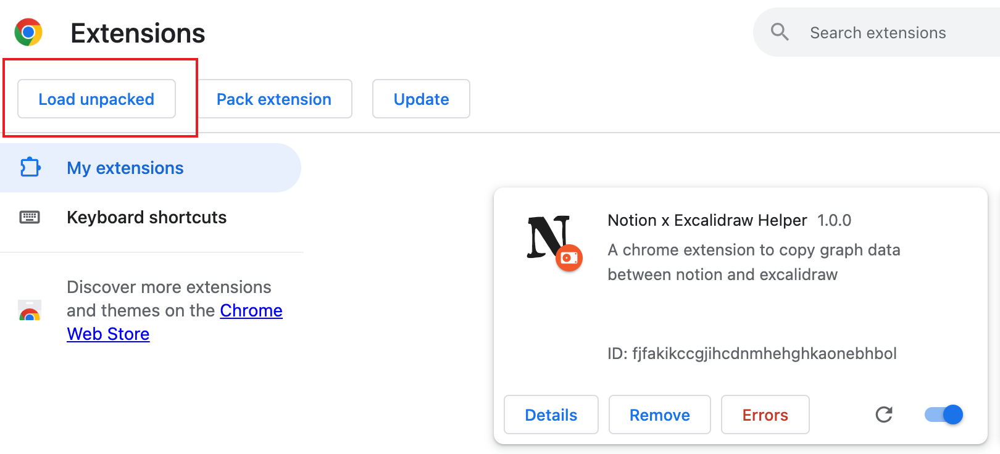
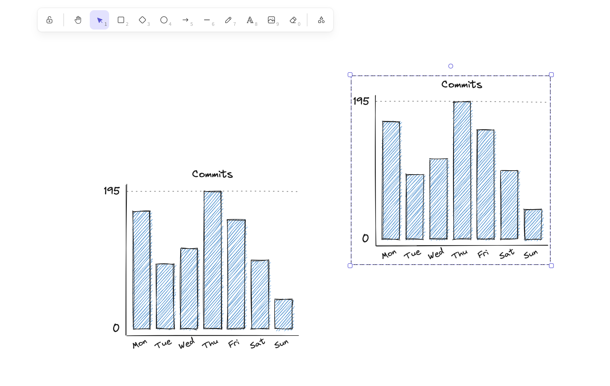

# chrome-extension-notion-excalidraw-helper

这是一个方便大家同时使用 notion 和 excelidraw 的小插件，可以方便的将 excelidraw 图形在 notion 和 excelidraw 之间互相拷贝，这样一来可以很方便的使用强大的 excelidraw 制作 notion 插图。

## 安装

**注意：** 目前 chrome 插件依然在应用商店审核阶段，所以暂时只提供 unpacked extension 的形式。

### Unpacked extension

Repo 中已经有构建好的 unpacked extension，可以直接打开 Chrome 的插件设置页，开启 developer mode，点击 Load unpacked，选择该 repo 中的 build 目录即可。



### 从源码构建
 
如果您需要对代码做一些改进，可以选择从代码来构建，也非常大家来提 PR 对该插件进行改进

``` shell
yarn
yarn build
```

## 使用方法

该插件的使用非常简单，有以下两个最基本的操作：

### 从 excelidraw 复制到 notion

在插件安装后，在 excelidraw 中用选框选中所需要复制的模型，使用复制文本的快捷键（比如 mac 是 command + C）


然后在 notion 粘贴，即可将 excelidraw 的图形以图片的形式粘贴到 notion。该图片带有 excelidraw 的原始数据，可以重新导入图片到excelidraw来继续编辑。


### 从 notion 复制到 excelidraw


对于已经包含有 excelidraw 原始数据的图片，hover 在图片上，点击带有 excelidraw 标志的按钮，一直等到该按钮变成 √，然后就可以打开 excelidraw 进行粘贴，原来的图形就会以可编辑的形式重新粘贴回 excelidraw，并且白板上原有的内容不会消失



对未安装插件的浏览者来说，它在 notion 上就是一张普通的图片，不会因为没有安装插件而影响观看。

## 为什么需要这个插件

### 从 excelidraw 复制到 notion

手动操作时，需要手动将图片导出为 png 到本地磁盘，然后再到 notion 添加一个 image block，手动上传该图片。

### 从 notion 复制到 excelidraw

手动操作时，需要手动从 notion 下载原始图片到本地磁盘，然后在 excelidraw 打开图片来导入；如果此时 excelidraw 白板上已经有内容，则需要先备份当前的数据，否则导入图片会让当前白板数据丢失。

总而言之，这个插件主要是为了降低在 notion 中嵌入 excelidraw 图形并且保留一些编辑功能的成本。

## 已知问题
- 在粘贴到 notion 时，偶尔渲染出来的手写字体会丢失，变成普通字体，通常发生在第一次粘贴时，暂时可以重新删掉再粘贴一次